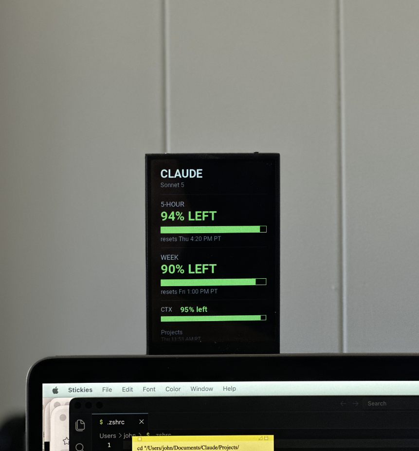

#  turing-smart-screen-python

### 🙏 Based on someone else's work — please read

This project is a fork built on top of **[mathoudebine/turing-smart-screen-python](https://github.com/mathoudebine/turing-smart-screen-python)**, the original open-source Python system monitor & abstraction library for small IPS USB smart screens. All of the core protocol, driver, and rendering code originates from that project — full credit to [@mathoudebine](https://github.com/mathoudebine) and its contributors for the original work. This fork trims things down to focus specifically on the single screen model used in this project (see below); for the full-featured upstream project supporting many more screen models, go to the [original repository](https://github.com/mathoudebine/turing-smart-screen-python).

Supported operating systems : macOS, Windows, Linux (incl. Raspberry Pi), basically all OS that support Python 3.9+  

### ✅ Screen used in this project:

| ✅ TURZX 3.5" / 5" IPS USB Secondary Screen (Turing Smart Screen)             |
|--------------------------------------------------------------------------------|
|   |
| Also improperly called "revision A" by resellers. Official forum: http://discuz.turzx.com/ |

**In use**, showing live Claude usage data (5-hour / weekly / context remaining):

If you haven't received your screen yet but want to start developing your theme now, you can use the [**"simulated LCD" mode!**](https://github.com/mathoudebine/turing-smart-screen-python/wiki/Simulated-display)

### Why a custom refresh policy (`claude-display.py`)

The TURZX screen was chosen mainly because it's **sub-$10** — but that comes with a noticeably **low refresh rate / slow panel update**. Pushing frames to it too often or repainting on every tick produces visible flicker/tearing and, worse, draws the eye to a screen that's meant to be background, ambient information, not something competing for attention.

To work around that, `claude-display.py` uses a deliberately conservative refresh policy designed to **minimize distracting visuals**:

* **Polls, doesn't stream**: the data file (`~/.claude/quota-meter/current.json`) is checked every **30 seconds** — not redrawn continuously.
* **Redraws only on change**: each poll computes a signature from the snapshot data plus its stale/active state; the screen is only repainted when that signature actually changes, so unchanged data never causes a flicker.
* **Staleness-aware dimming**: if no fresh data has arrived in **180 seconds (3 minutes)**, the display is considered stale and its brightness drops from **18 (active) to 4 (idle)**, fading into the background instead of staying eye-catchingly bright.
* **Clean shutdown**: brightness is set to **0** when the process exits, so the low-refresh panel doesn't linger on a stale frame.

Net effect: the screen updates just often enough to stay useful, while the slow/cheap panel's redraw quirks are hidden rather than amplified.

## How to start

### [> Follow instructions on the wiki to configure and start this project.](https://github.com/mathoudebine/turing-smart-screen-python/wiki)

There are 2 possible uses of this project Python code:
* **[as a System Monitor](#system-monitor)**, a standalone program working with themes to display your computer HW info and custom data in an elegant way.
[Check if your hardware is supported.](https://github.com/mathoudebine/turing-smart-screen-python/wiki/System-monitor-:-hardware-support)
* **[integrated in your project](#control-the-display-from-your-python-projects)**, to fully control the display from your own Python code.

## System monitor

This project is mainly a complete standalone program to use your screen as a system monitor, like the original vendor app.  
Some themes are already included for a quick start!  
### [> Configure and start system monitor](https://github.com/mathoudebine/turing-smart-screen-python/wiki/System-monitor-:-how-to-start)
  

* Fully functional multi-OS code base (operates out of the box, tested on Windows, Linux & MacOS).
* Display configuration using GUI configuration wizard or `config.yaml` file: no Python code to edit.
* Compatible with the TURZX 3.5" & 5" IPS USB Secondary Screen (Turing Smart Screen). Backplate RGB LEDs are also supported for available models!
* Support [multiple hardware sensors and metrics (CPU/GPU usage, temperatures, memory, disks, etc)](https://github.com/mathoudebine/turing-smart-screen-python/wiki/System-monitor-:-themes#stats-entry) with configurable refresh intervals.
* Allow [creation of themes (see `res/themes`) with `theme.yaml` files using theme editor](https://github.com/mathoudebine/turing-smart-screen-python/wiki/System-monitor-:-themes) to be [shared with the community!](https://github.com/mathoudebine/turing-smart-screen-python/discussions/categories/themes)
* Easy to expand: [custom Python data sources](https://github.com/mathoudebine/turing-smart-screen-python/wiki/System-monitor-:-themes#add-custom-stats-to-a-theme) can be written to pull specific information and display it on themes like any other sensor.
* Auto-detect COM port based on the selected smart screen model.
* Tray icon with Exit option, useful when the program is running in background.

### [> List and preview of included themes](res/themes/themes.md)
       ... [view full list](res/themes/themes.md)
### [> Themes creation/edition (using theme editor)](https://github.com/mathoudebine/turing-smart-screen-python/wiki/System-monitor-:-themes)
### [> Themes shared by the community](https://github.com/mathoudebine/turing-smart-screen-python/discussions/categories/themes)
 
  and more... Share yours!

## Control the display from your Python projects

If you don't want to use your screen for system monitoring, you can just use this project as a module from any Python code to do some simple operations on the display:
- **Display custom picture**
- **Display text**
- **Display horizontal / radial progress bar**
- **Screen rotation**
- Clear the screen (blank)
- Turn the screen on/off
- Display soft reset
- Set brightness
- Set backplate RGB LEDs color (on supported hardware rev.) 

This project will act as an abstraction library to handle specific protocols and capabilities of each supported smart screen models in a transparent way for the user.
Check `simple-program.py` as an example.

### [> Control the display from your code](https://github.com/mathoudebine/turing-smart-screen-python/wiki/Control-screen-from-your-own-code)

## Troubleshooting
If you have trouble running the program as described in the wiki, please check [open/closed issues](https://github.com/mathoudebine/turing-smart-screen-python/issues) & [the wiki Troubleshooting page](https://github.com/mathoudebine/turing-smart-screen-python/wiki/Troubleshooting)

## They're talking about it!

* [Hackaday - Cheap LCD Uses USB Serial](https://hackaday.com/2023/09/11/cheap-lcd-uses-usb-serial/)  

* [CNX Software - Turing Smart Screen – A low-cost 3.5-inch USB Type-C information display](https://www.cnx-software.com/2022/04/29/turing-smart-screen-a-low-cost-3-5-inch-usb-type-c-information-display/)

* [Phazer Tech - Turing Smart Screen Python ](https://phazertech.com/tutorials/turing-smart-screen.html)

## Star History

