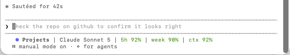

# Claude usage statusline

This project originally tracked [Claude Code](https://claude.com/claude-code) usage on a physical [TURZX secondary screen](README.md). That approach was eventually abandoned in favor of showing the same data directly in the terminal, via a Claude Code **statusline** — a script Claude Code runs on every prompt and renders under the command line.



Example output:

```
● Projects | Claude Sonnet 5 | 5h 92% | week 90% | ctx 92%
```

## What it's made of

* **A Claude Code `statusLine` hook** — configured in `~/.claude/settings.json`, pointing at a shell script. Claude Code invokes that script on every prompt render and pipes a JSON status payload into it via stdin.
* **[`claude-quota-statusline.sh`](statusline/claude-quota-statusline.sh)**, a small Bash script that:
  * Parses the incoming JSON with `jq` — model name, current/project directory, rate-limit percentages (`five_hour`, `seven_day`), and context window usage.
  * Hashes the project directory name into a fixed 20-color ANSI palette so every project automatically gets a stable, distinct colored `●` badge with zero per-project configuration.
  * Derives "percent remaining" for the 5-hour window, weekly window, and context window, and color-codes each: green (>50% left) → amber (25-50%) → red (≤25%) → bold red (≤10%).
  * Writes a normalized snapshot to `~/.claude/quota-meter/current.json` on every refresh — the same file the old `claude-display.py` screen project polled, so this script is effectively a drop-in replacement data feed for anything that wants to consume Claude usage data, in addition to printing it inline.
* **Output format**: `● <project> | Claude <model> | 5h X% | week Y% | ctx Z%`.

## Prerequisites

* [Claude Code](https://claude.com/claude-code) installed and configured.
* [`jq`](https://jqlang.org/) available on your `PATH`:
  ```bash
  brew install jq        # macOS
  sudo apt install jq    # Debian/Ubuntu
  ```

## Setup steps

1. **Copy the script** into your Claude config directory and make it executable:
   ```bash
   mkdir -p ~/.claude
   cp statusline/claude-quota-statusline.sh ~/.claude/claude-quota-statusline.sh
   chmod +x ~/.claude/claude-quota-statusline.sh
   ```

2. **Wire it up in `~/.claude/settings.json`** by adding (or merging into) a `statusLine` entry:
   ```json
   {
     "statusLine": {
       "type": "command",
       "command": "~/.claude/claude-quota-statusline.sh",
       "padding": 1,
       "refreshInterval": 30
     }
   }
   ```
   If `~/.claude/settings.json` already has other keys, merge this in rather than overwriting the file.

3. **Start (or restart) a Claude Code session.** The statusline appears under the command line on the next prompt render and refreshes every 30 seconds.

4. **Verify it's working:**
   ```bash
   cat ~/.claude/quota-meter/current.json
   ```
   This file is rewritten on every refresh and should show current `five_hour`, `seven_day`, and `context_window` usage.

## Troubleshooting

* **Nothing shows up** — confirm `jq` is installed and on `PATH`, and that `~/.claude/claude-quota-statusline.sh` is executable (`chmod +x`).
* **Colors look wrong in your terminal** — the script uses 256-color ANSI escape codes; make sure your terminal/terminal multiplexer is configured for 256-color support (`echo $TERM` should be something like `xterm-256color`).
* **Want to feed a physical display instead (or in addition)** — anything can poll `~/.claude/quota-meter/current.json` the same way `claude-display.py` in this repo used to.
